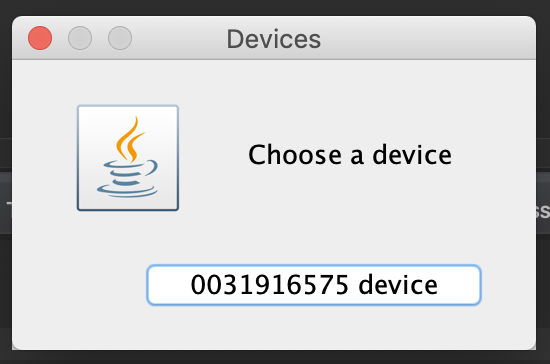
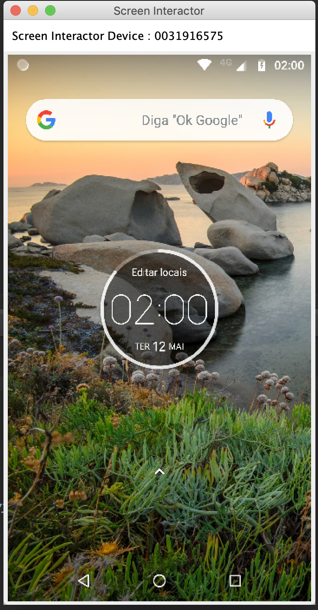

# android_screen_interactor
Simple Swing Aplication. Send comands to android via ADB 

Select a device plugued at computer.

Make Scroll, Toutch, Text Write. 
Capture Screen to improve interaction with device.

You Need ADB instaled in your computer.
This is simple if you instaled Android Studio.

